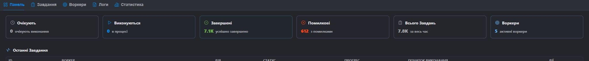
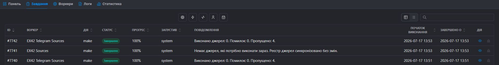
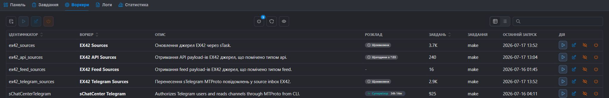
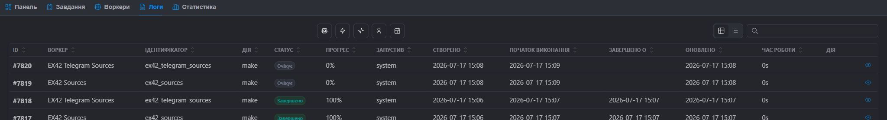
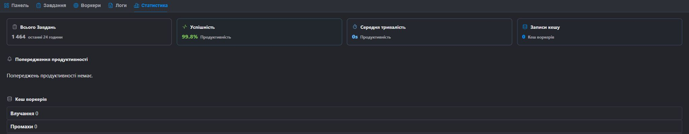

# Интерфейс менеджера

Модуль имеет пять вкладок Livewire: **Панель**, **Задачи**, **Рабочие**, **Логи**, **Статистика**. Переключение происходит без полной перезагрузки фрейма менеджера. Начальная вкладка может быть передана параметром запроса `get`; Неизвестное значение заменяется на `dashboard`.

## Доступ

Оболочка модуля и детали задачи могут быть открыты пользователем-менеджером с разрешения `stask`. Все HTTP-маршруты находятся в группе промежуточного ПО `mgr`. Некоторые экшн-эндпоинты зависят только от `mgr` промежуточного ПО и не вызывают `hasPermission('stask')` многократно, поэтому не публикуйте `/stask/*` вне аутентификации менеджера.

## Общие правила EvoUI

Таблицы **Задачи**, **Рабочие**, **Логи** поддерживают:

- поиск;
- на страницу: 15, 30, 50, 100, 200 (по умолчанию 30);
- Вид таблицы/списка;
- сортировка только по столбцам, отмеченным `sortable` в предустановленном режиме;
- фильтры с множественным выбором и диапазоном дат;
- рядовые действия;
- двойной клик во всех просмотрах строк: в панели, в разделе «Задачи и журналы» открываются детали задачи, а в «Рабочих» — модальное редактирование.

На сервере применяются поиск и фильтры. Просмотр списка меняет представление, а не набор данных.

## Панель

### Карты

Панель показывает подсчёты, поставленные в очередь, работающие, завершенные, невыполненные, рабочие и действующие работники. Затем следуют недавние задачи и, если доступны, отдельная таблица недавних ошибок.

### Недавние задачи

Столбцы: ID, Работник, Действие, Статус, Прогресс, Начало выполнения, Действия. Для активной задачи строка получает URL прогресса, и `stask-module.js` периодически читает снимок без истории журналов (`include_log=0`).

Двойной клик или иконка `eye` открывает модаль с основными полями, журналом задач, метой и результатом. Контент только для чтения.

### Живой прогресс

Индикаторы прогресса, значения и сообщение обновляются с помощью HTTP-опросов. Поддерживается надёжный встроенный Markdown: обратные отметки, жирный, зачеркнутый путь, выделение. Сначала HTML уходит. В финальном состоянии Livewire обновляет панель один раз.

## Задачи

### Поиск

Поиск по числовому идентификатору, `identifier`, `action`, `message`.

### Фильтры

- **Worker** — это поисковый список с человеческими `worker->title`, а не сырыми идентификаторами.
- **Действие** — отдельные действия из базы данных.
- **Status** — очередь, подготовка, запуск, завершение, неудача.
- **User** — менеджеры пользователей, которые уже выполнили задачи, плюс `system` для `started_by IS NULL OR <= 0`.
- **Диапазон создания** — границы, охватывающие от начала дня до конца дня.

Приоритеты и попытки не являются релевантными столбцами или фильтрами этой вкладки. Они остаются полями runtime/схемы для совместимости, но не документируются как управление интерфейсом.

### Колонны

| Колонка | Значение |
| --- | --- |
| ID | `#id`; Новейшее первое для Default |
| Рабочий | Локализованный/человеческий титул или идентификатор запасной вариант |
| Экшн | Кодекс действий |
| Статус | Значок числового статуса |
| Прогресс | `0–100%`; Активный ряд можно обновлять в реальном времени |
| Бегая | Имя пользователя или `system` |
| Сообщения | сохраненное сообщение с безопасным рендерингом Markdown |
| Начало исполнения | `start_at`; Для задачи с будущей очередью это запланированное время |
| Завершено | `finished_at` |

### Действия

- `eye` — модальные детали.
- `player-eject` — аварийная остановка для очереди/подготовки/запуска.

Экстренная остановка показывает статус failed, `finished_at = now()` и сообщение «Задача остановилась». Он **не завершает процесс PHP/OS**. Если процесс продолжает работать, данные или файл прогресса всё равно могут измениться.

Двойной клик по линии открывает модаль деталей.

## Рабочие

### Поиск и фильтры

Поиск: идентификатор, область действия, класс. Фильтры:

- активный/неактивный;
- класс доступен/отсутствует;
- видимой/скрытой.

### Колонны

- Идентификатор.
- Работник — титул с экземпляром класса.
- Описание — отрывок до 96 символов.
- Расписание — чип; Для Healthy Supervisor значок показывает время работы после `niceEta()`.
- Количество задач — `niceCount()` (компактное локализованное число).
- Последнее действие.
- Последний запуск — временная метка последней записи задачи.

Скрыто — флаг видимости менеджера; Запись работника не удаляется. Неактивный работник не может быть запущен, и планировщик пропускает его.

### Действия панели инструментов и строк

- `database-cog` — обнаружить + пересканировать + очистить сироту + очистить рабочий кэш.
- `player-play` — начинает выбранный/строковый рабочий только если активен, класс существует и `taskMake()`.
- `edit` — модальные настройки.
- `power` — активный переключатель.
- `eye/eye-off` — переключатель видимости.

Реестр обновления может удалять записи, класс которых больше не существует. Перед началом продакшна проверьте, что автозагрузка Composer завершена и развертывание не находится в промежуточном состоянии.

### Модальный работник

Только для чтения: название, идентификатор, область применения, класс, описание. Редактируемо: активно, скрыто, позиция, расписание, дополнительная загрузка настроек JSON.

Дополнительный JSON не должен содержать `schedule`-ключ: при сохранении он извлекается и заменяется значениями формы. Недействительный JSON не хранится; Провайдер оставляет прежние пользовательские настройки.

Для класса, способного к супервайзеру, также показывается:

- ключ;
- Государственный знак;
- PID;
- сердцебиение;
- рабочее время (`niceEta`);
- последний диагноз;
- Последний переход.

Опция супервайзера скрыта, если класс не реализует `SupervisorWorkerInterface`.

## Бревна

Это не отдельная таблица журналов: вкладка читает `s_tasks` и показывает историю задач более подробно.

### Поиск и фильтры

Поиск: ID, идентификатор, действие, сообщение. Фильтры: название работника, действие, статус, пользователь, включая `system`, диапазон дат создания.

### Колонны

ID-ссылка, название работника, идентификатор, действие, статус, прогресс, начато, создано, начало, завершено, обновлено, **Время работы**.

**Runtime** использует продолжительность задачи: для финальной задачи `finished_at - start_at`, для активного `now - start_at`. Форматирование выполняется `niceEta()`. Ключ перевода имени используется в режиме безотказной работы супервайзера, но здесь это время выполнения задачи.

ID открывает отдельную страницу с информацией. Двойной клик открывает модаль только для чтения с сообщением, мета, результатом и классом работника.

## Статистика

Показывает карты производительности за последние 24 часа, оповещения и статистику кэша работников.

Реал по текущей реализации:

- подсчёт задач;
- уровень успеха/ошибки с записями статуса;
- группирование рабочих;
- попадания, промахи, выселения, частота попаданий, размер кэша;
- Очистка кэша работников.

Ограничения: `MetricsService` пока возвращает `0` по средней продолжительности, средней памяти и общему времени выполнения при агрегировании из записей задач; Распространённые ошибки — это также пустой временный вариант. Не используйте эти значения в качестве производственного SLI без внешней телеметрии.

`niceSize()` используется для читаемых человеком значений памяти, где существует вещественное значение байта; `niceCount()` — для графов; `niceEta()` на секунды/длительность.

## Безопасность данных

Мета, результат, сообщения и журнал прогресса видны управляющим пользователям, имеющим доступ к модулю. Не делитесь паролями, API-токенами, строками сессий или личными данными, если только не нужно показывать их оператору. Конечные точки загрузки/загрузки имеют валидацию для конкретного сотрудника, но работнику всё равно необходимо проверить тип, размер и содержимое файла.
